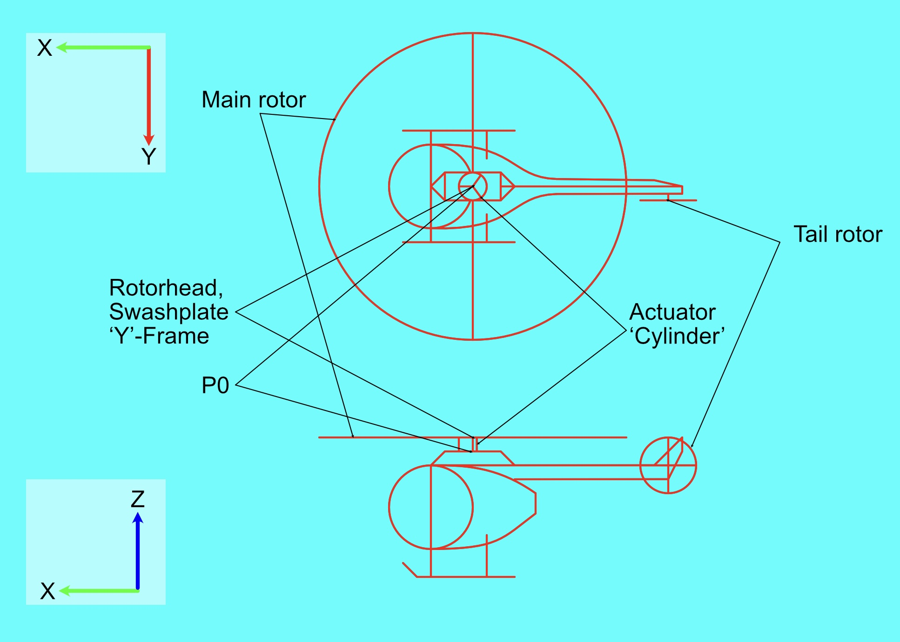

### Introduction
 
I wanted to learn more about how a helicopter works, specifically how the rotors are controlled.  So I built a rotor-head out of LEGO and did some math.  I also relearned a lot about typesetting equations I knew about a decade ago.  I also learned about a method of helicopter control known as cyclic-collective pitch mixing, which is the algorithm I'll be discussing here.

For more detailed information, see RotorHead.ipynb

This project is dependent on PyBricks for rotor.py and OpenCV for rotormath.py.  For a full
list of packages installed as I type this, see pip_freeze.txt.

 - RotorHead.ipynb: a jupyter notebook describing the project
 - controllers.py: game controller interface
 - cvgraph.py: opencv-based animation convenience funcetions
 - joycode.py: a lightweight wire protocol for transmitting game controller data to the hub
 - linear.py: a translation layer to make linear algebra identical under numpy and pybricks
 - rotor.py: the control program that runs on the Technic Hub
 - rotorbase.py: base station that decodes gamepad data and sends it to the hub
 - rotormath.py: an animated simulation of the algorithm
 - swashplate.py: the code that does the actual swashplate calculation
 - sympy_test.ipynb: a sandbox notebook used for relearning sympy
