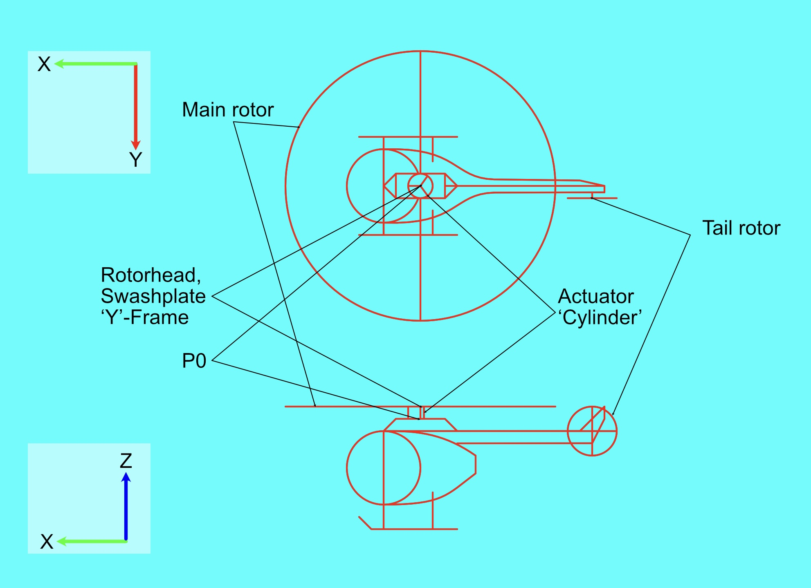

### Introduction
 
I wanted to learn more about how a helicopter works, specifically how the rotors are controlled.  So I built a rotor-head out of LEGO and did some math.  I also relearned a lot about typesetting equations I knew about a decade ago.  I also learned about a method of helicopter control known as cyclic-collective pitch mixing, which is the algorithm I'll be discussing here.

For more detailed information, see RotorHead.ipynb

This project is dependent on PyBricks 3.4.0 for rotor.py and OpenCV for rotormath.py.  For a full
list of packages installed as I type this, see pip_freeze.txt.

### PyBricks links
* [PyBricks Main Site](https://pybricks.com)
* [Install PyBricks on Boost/SPIKE](https://pybricks.com/install/spike-mindstorms/)
* [PyBricks Documentation Root](https://docs.pybricks.com/en/latest/)
* [PyBricks Powered Up Hub](https://docs.pybricks.com/en/latest/hubs/technichub.html)
* [Beta PyBricks SPIKE Hub](https://github.com/pybricks/support/issues/591)
* [PyBricksDev Command Line](https://github.com/pybricks/pybricksdev)
* [MicroPython main github](https://github.com/micropython/micropython)
* [PrimeHub class documentation](https://docs.pybricks.com/en/latest/hubs/primehub.html)

### Building
* [Building for Mac](https://github.com/pybricks/pybricks-micropython/blob/work/CONTRIBUTING.md)

I used the 5.3 release of the [GNU ARM Embedded Toolchain](https://launchpad.net/gcc-arm-embedded/5.0/5-2016-q1-update)

Put the toolchain binary in your path and it should build without issue.
export PATH="/Users/kujawa/Projects/chs/gcc-arm-none-eabi-5_3-2016q1/bin/:$PATH"

(needs GNU ARM Embedded Toolchain v10-2020-q4
 for 3.x https://github.com/pybricks/pybricks-micropython/blob/master/CONTRIBUTING.md)
 
### Code Manifest
 - RotorHead.ipynb: a jupyter notebook describing the project
 - controllers.py: game controller interface
 - cvgraph.py: opencv-based animation convenience funcetions
 - joycode.py: a lightweight wire protocol for transmitting game controller data to the hub
 - linear.py: a translation layer to make linear algebra identical under numpy and pybricks
 - rotor.py: the control program that runs on the Technic Hub
 - rotorbase.py: base station that decodes gamepad data and sends it to the hub
 - rotormath.py: an animated simulation of the algorithm
 - swashplate.py: the code that does the actual swashplate calculation
 - sympy_test.ipynb: a sandbox notebook used for relearning sympy
